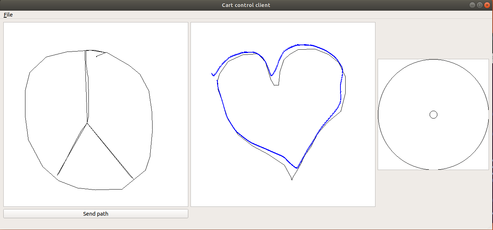

# cartControlRos

Control plugin for [omni-wheel SDF cart](https://github.com/GuiRitter/OpenBase)

# Requiremets
[omni-wheel SDF cart](https://github.com/GuiRitter/OpenBase)  requirements,
qt5, cMake 3.1.0

# Make
+ Make sure you setup all ROS environment variables ( describe [here](http://wiki.ros.org/ROS/Tutorials/InstallingandConfiguringROSEnvironment))
+ `cd plugin`
+ `mkdir build`
+ `cd build`
+ `cmake ../`
+ `make`

After that in directory `../plugin/build/devel/lib/`

libmain.so -plugin lib ( cart integration instruction [here](https://github.com/GuiRitter/OpenBase/blob/master/tutorial/getting%20started.md))

CartControlPlugin/client - client executable

# Usage
There are three widgets (from left to right)
+ Path setter
+ Path getter
+ Joystick

Move mouse [like this](https://www.youtube.com/watch?v=Phsat1QcTdI) on the joystick to move robot

Click on the path setter to setup path, click "Send path" button to send it to the plugin 

